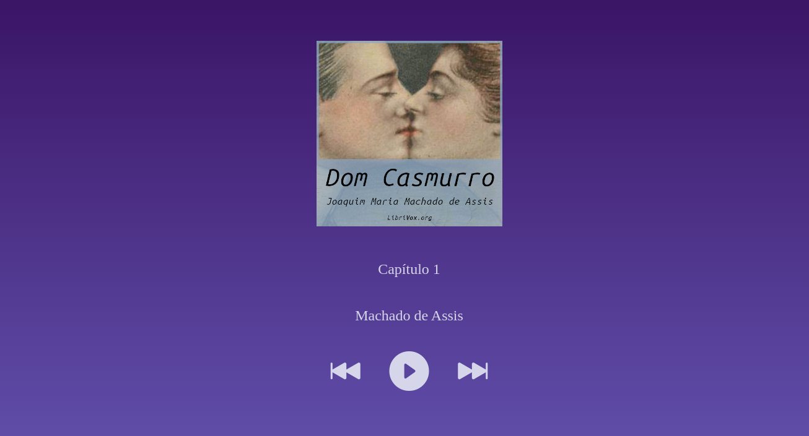

<h1 align="center">Audio Book</h1>

Projeto desenvolvido seguindo a <a target="_blank" href="https://www.youtube.com/watch?v=0OKGGpMPeyM">primeira aula</a>
do intensivão de JavaScript.

## 🌟 Projeto
Este é um aplicativo simples que faz uso do JavaScript para criar um player para audiolivros.

## 👾 Tecnologias
 - HTML5
 - JAVASCRIPT
 - CSS3

## 🏃 Visualizar projeto
Teste e veja como ficou o aplicativo, <a target="_blank" href="https://play-audio-book.netlify.app/">clicando aqui</a>.
